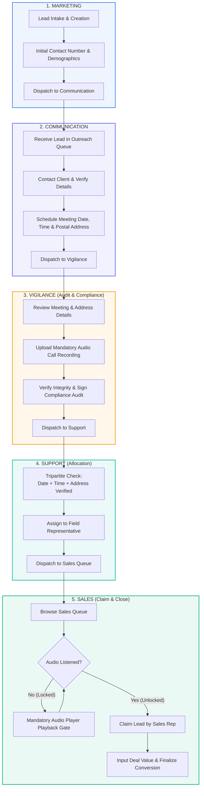
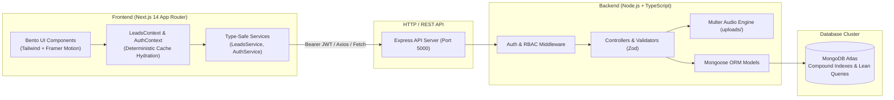

# ⚡ Vibh-Anu CRM — Enterprise Lead Lifecycle & Department Orchestration Engine

<div align="center">


<br/>

**A mission-critical B2B CRM engine enforcing strict sequential lead progression across 5 specialized enterprise departments, backed by mandatory audio compliance gating, role-based bento dashboards, and instant-render performance.**

[Features](#-key-features) • [Workflow](#-sequential-lead-lifecycle) • [Architecture](#-system-architecture) • [RBAC & Demo Credentials](#-role-based-access-control--demo-credentials) • [Quickstart](#-getting-started) • [API Specs](#-rest-api-overview)

</div>

---

## 🌟 Executive Overview

**Vibh-Anu CRM** solves the enterprise lead slippage and compliance problem. Unlike standard generic CRMs where any team member can arbitrarily edit or skip lifecycle stages, Vibh-Anu CRM enforces an **ironclad, sequential 5-stage departmental pipeline**:

$$\text{Marketing} \longrightarrow \text{Communication} \longrightarrow \text{Vigilance} \longrightarrow \text{Support} \longrightarrow \text{Sales (Claim)}$$

Every transition requires specific verified data inputs. Notably, **leads cannot be claimed or closed by Sales without passing through Vigilance's mandatory audio call recording audit**, followed by Support's tripartite address/date/time verification.

---

## 🎯 Key Features

### 🏢 1. Ironclad Sequential Lead Progression
- **Marketing Intake**: Lead creation with basic demographics, contact validation, and source tagging.
- **Communication Scheduling**: Direct outreach, postal address verification, and calendar-backed meeting scheduling.
- **Vigilance Compliance & Audio Gate**: Verification review, mandatory upload of recorded phone/audio proof, and compliance lock.
- **Support Allocation**: Validation of meeting date, time, and address checkpoints; allocation to field agents or executives.
- **Sales Claim & Audio Listener Gate**: Sales reps are strictly prevented from claiming leads until they have listened to the compliance audio verification recording. Once claimed, deals are negotiated and closed.

### 🍱 2. Bento-Style Role-Specific Dashboards
- Tailored workspaces for **6 Distinct Roles**: `ADMIN`, `MARKETING`, `COMMUNICATION`, `VIGILANCE`, `SUPPORT`, and `SALES`.
- High information-density Bento-grid widgets featuring real-time KPIs, workload distributions, department action queues, and chronological audit trails.
- Visual design inspired by **Linear**, **Raycast**, and **Stripe**, offering clean typography, micro-interactions, and visual calm.

### ⚡ 3. Ultra-Fast Data Fetching & Zero Hydration Mismatches
- **Zero Hydration Errors**: Deterministic SSR paired with post-mount cache hydration completely eliminates server-to-client DOM mismatches.
- **Sub-16ms First Meaningful Paint**: Instant warm loads via client-side session caching with background MongoDB Atlas revalidation (`stale-while-revalidate`).
- **Race Condition Prevention**: Monotonic request counters safeguard against out-of-order network responses.
- **MongoDB Atlas Optimization**: High-efficiency compound indexes, lean queries (`.lean()`), and tuned connection pooling.

### 🛡️ 4. Persistent Shell Architecture
- The `<Sidebar />` and `<Header />` live inside a persistent `<AppShell>` that **never unmounts, never blinks, and never shows skeletons** during page transitions or role switches.
- Loading states and skeletons are strictly confined to individual widgets or the main content container via scoped page transitions.

### 🎨 5. Design System & Smooth Motion
- **Precision Easing**: Framer Motion transitions tuned to `cubic-bezier(0.22, 1, 0.36, 1)`.
- **System Theme Support**: Seamless Light / Dark theme switching with a reactive palette and customizable accent colors.
- **Accessible Micro-Interactions**: Role badges, audit status chips, audio waveform controls, and toast notifications powered by `Sonner`.

---

## 🔄 Sequential Lead Lifecycle



---

## 🏗️ System Architecture



---

## 👥 Role-Based Access Control & Demo Credentials

The platform includes seed data with 6 role-tailored user accounts. Use any of the credentials below to test department workflows:

| Role | Demo User | Demo Email | Password | Department Scope & Permissions |
| :--- | :--- | :--- | :--- | :--- |
| **`ADMIN`** | Ananya Sharma | `admin@vibhanu.com` | `VibhAnu@123` | **Full Global Access**: Can view and orchestrate all 5 departments, configure settings, and inspect system audit trails. |
| **`MARKETING`** | Rohan Varma | `marketing@vibhanu.com` | `VibhAnu@123` | **Intake & Discovery**: Create leads, import records, view marketing acquisition metrics. |
| **`COMMUNICATION`** | Pooja Hegde | `communication@vibhanu.com` | `VibhAnu@123` | **Outreach & Scheduling**: Contact prospect, confirm postal address, schedule meeting dates & time slots. |
| **`VIGILANCE`** | Vikram Malhotra | `vigilance@vibhanu.com` | `VibhAnu@123` | **Compliance & Audit**: Verify accuracy, upload mandatory MP3/WAV/M4A call audio recordings. |
| **`SUPPORT`** | Neha Sundaram | `support@vibhanu.com` | `VibhAnu@123` | **Operations & Allocation**: Tripartite verification (Date/Time/Address), field assignment, add operational notes. |
| **`SALES`** | Aditya Deshmukh | `sales@vibhanu.com` | `VibhAnu@123` | **Closing & Conversion**: Listen to compliance audio recording, claim verified leads, close deals with revenue figures. |

> 💡 **Quick Role Switcher**: When logged in, click the role switcher in the top navigation header to instantly jump between departments without logging out.

---

## 💻 Tech Stack

### Frontend
- **Framework**: [Next.js 14.2.15](https://nextjs.org/) (App Router, React Server & Client Components)
- **Library**: [React 18.3.1](https://react.dev/)
- **Language**: [TypeScript 5.6](https://www.typescriptlang.org/)
- **Styling**: [Tailwind CSS 3.4](https://tailwindcss.com/) with CSS variables
- **Motion & Transitions**: [Framer Motion 11.11](https://www.framer.com/motion/)
- **Icons**: [Lucide React](https://lucide.dev/)
- **Form Management**: [React Hook Form](https://react-hook-form.com/) + [Zod 3.23](https://zod.dev/)
- **Notifications**: [Sonner](https://sonner.emilkowal.ski/) toast system

### Backend & Database
- **Runtime & Server**: [Node.js](https://nodejs.org/) + [Express 4.21](https://expressjs.com/)
- **Language**: TypeScript with [tsx](https://github.com/privatenumber/tsx) execution
- **Database**: [MongoDB Atlas](https://www.mongodb.com/atlas) with [Mongoose 8.7](https://mongoosejs.com/)
- **File Handling**: [Multer](https://github.com/expressjs/multer) for compliance audio recordings
- **Authentication**: JWT (JSON Web Tokens) + [bcryptjs](https://github.com/dcodeIO/bcrypt.js)
- **Logging**: [Pino](https://getpino.io/) & `pino-pretty`

---

## 📁 Project Directory Structure

```plaintext
Vibh-Anu-CRM/
├── app/                                # Next.js 14 App Router Pages
│   ├── communication/                  # Communication department queue & actions
│   ├── leads/                          # Global Lead Directory & Detail view
│   ├── login/                          # Authentication portal
│   ├── marketing/                      # Marketing department queue & lead creation
│   ├── sales/                          # Sales queue with audio gating & claim modal
│   ├── settings/                       # System & accent preferences
│   ├── support/                        # Support allocation queue
│   ├── vigilance/                      # Vigilance queue with audio upload
│   ├── layout.tsx                      # Root layout with Theme, Auth & Leads providers
│   ├── loading.tsx                     # Non-blocking page content loader
│   └── page.tsx                        # Root dynamic bento dashboard switcher
├── backend/                            # Express + TypeScript Backend
│   ├── src/
│   │   ├── config/                     # Database, environment & logger configuration
│   │   ├── constants/                  # Department, role, and permission definitions
│   │   ├── controllers/                # Request handlers (auth, leads, dashboard)
│   │   ├── middleware/                 # Auth verification, RBAC guard, file upload
│   │   ├── models/                     # Mongoose schemas (User, Lead, AuditLog)
│   │   ├── routes/                     # REST API route endpoints
│   │   ├── scripts/                    # Database seeder (Atlas demo population)
│   │   └── server.ts                   # Express server bootstrap
│   ├── uploads/                        # Persisted compliance audio files
│   ├── .env                            # Backend configuration & Atlas URI
│   └── package.json
├── components/                         # Modular React UI Components
│   ├── dashboard/                      # Role-specific Bento dashboards & shared widgets
│   ├── layout/                         # AppShell, Sidebar, Header, PageHeader
│   └── ui/                             # Buttons, Badges, Modals, AudioPlayer, Tables
├── constants/                          # Client-side roles and navigation maps
├── context/                            # LeadsContext, AuthContext, AccentContext
├── services/                           # API abstraction layer (LeadsService, AuthService)
├── types/                              # TypeScript interfaces (Leads, Auth, Workflow)
├── package.json                        # Frontend dependencies & scripts
└── tailwind.config.ts                  # Design tokens & color system
```

---

## 🚀 Getting Started

### Prerequisites
- **Node.js**: v18.17.0 or higher
- **npm** or **yarn** / **pnpm**
- **MongoDB Atlas** cluster or standard MongoDB connection string

---

### Step 1: Clone & Install Dependencies

```bash
# 1. Clone repository
git clone https://github.com/your-username/vibh-anu-crm.git
cd vibh-anu-crm

# 2. Install Frontend dependencies
npm install

# 3. Install Backend dependencies
cd backend
npm install
cd ..
```

---

### Step 2: Configure Environment Variables

Create or verify `backend/.env`:

```env
NODE_ENV=development
PORT=5000
MONGO_URI=your_mongodb_atlas_connection_string
JWT_SECRET=your_super_secret_jwt_key_2026
JWT_EXPIRES_IN=7d
CLIENT_URL=http://localhost:3000
UPLOAD_DIR=./uploads
MAX_AUDIO_FILE_SIZE=15728640
```

*(Optional)* Create `.env.local` in the project root if overriding the frontend API endpoint:
```env
NEXT_PUBLIC_API_URL=http://localhost:5000/api
```

---

### Step 3: Seed the Database with Realistic Demo Data

Populate your MongoDB Atlas cluster with realistic enterprise leads across all 5 departments and configured user roles:

```bash
npm run seed
```

---

### Step 4: Run the Development Servers

Open two terminal instances:

#### Terminal 1 — Backend API
```bash
cd backend
npm run dev
# Running on http://localhost:5000
```

#### Terminal 2 — Frontend Application
```bash
npm run dev
# Running on http://localhost:3000
```

Visit **[http://localhost:3000](http://localhost:3000)** in your browser and log in with any of the demo accounts!

---

## 📡 REST API Overview

| Method | Endpoint | Description | Department / Role Required |
| :--- | :--- | :--- | :--- |
| `POST` | `/api/auth/login` | Authenticate user & issue JWT | Public |
| `GET` | `/api/auth/me` | Fetch active user session profile | Authenticated |
| `GET` | `/api/leads` | Query leads with pagination, search, & department filter | All authenticated |
| `POST` | `/api/leads` | Create new prospect lead | `MARKETING`, `ADMIN` |
| `GET` | `/api/leads/:id` | Retrieve comprehensive lead profile with audit log | All authenticated |
| `PATCH` | `/api/leads/:id/communication` | Schedule meeting date, time, and record address | `COMMUNICATION`, `ADMIN` |
| `POST` | `/api/leads/:id/vigilance/audio` | Upload mandatory compliance call audio file | `VIGILANCE`, `ADMIN` |
| `PATCH` | `/api/leads/:id/vigilance` | Confirm compliance audit and push to Support | `VIGILANCE`, `ADMIN` |
| `PATCH` | `/api/leads/:id/support` | Validate checklist & allocate field representative | `SUPPORT`, `ADMIN` |
| `POST` | `/api/leads/:id/sales/listen` | Mark mandatory audio playback completed | `SALES`, `ADMIN` |
| `PATCH` | `/api/leads/:id/sales/claim` | Claim lead, record deal value, and close deal | `SALES`, `ADMIN` |
| `GET` | `/api/dashboard/stats` | Compute aggregated KPIs across all departments | All authenticated |
| `GET` | `/api/health` | Backend and database connectivity health probe | Public |

---

## 🧪 Testing & Production Build

### Type Check & Production Compilation
```bash
# Frontend TypeScript check
npx tsc --noEmit

# Frontend Next.js production build
npm run build

# Backend TypeScript build
npm --prefix backend run build
```

### Running Backend Integration Tests
```bash
npm --prefix backend test
```

---

## 🛡️ Enterprise Security & Compliance

- **Role-Based Guards**: Strict Express middleware validating JWT tokens against role capability bitmaps.
- **Audio Integrity Gate**: Cryptographic-like sequential enforcement ensuring sales reps cannot claim leads without auditable verification playback logs.
- **Input Sanitization**: Strong schema enforcement via **Zod** across every API payload.
- **Security Headers & Throttling**: Pre-configured with `helmet`, `cors`, and `express-rate-limit` to prevent brute-force attacks.

---

## 📄 License

This project is licensed under the **MIT License**.

<div align="center">
Built with precision for enterprise reliability and seamless team orchestration.
</div>
